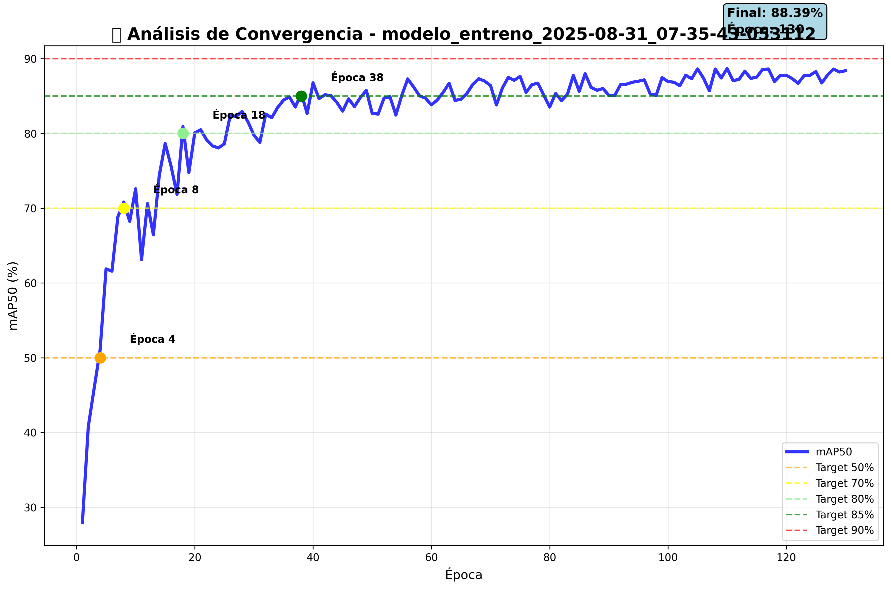
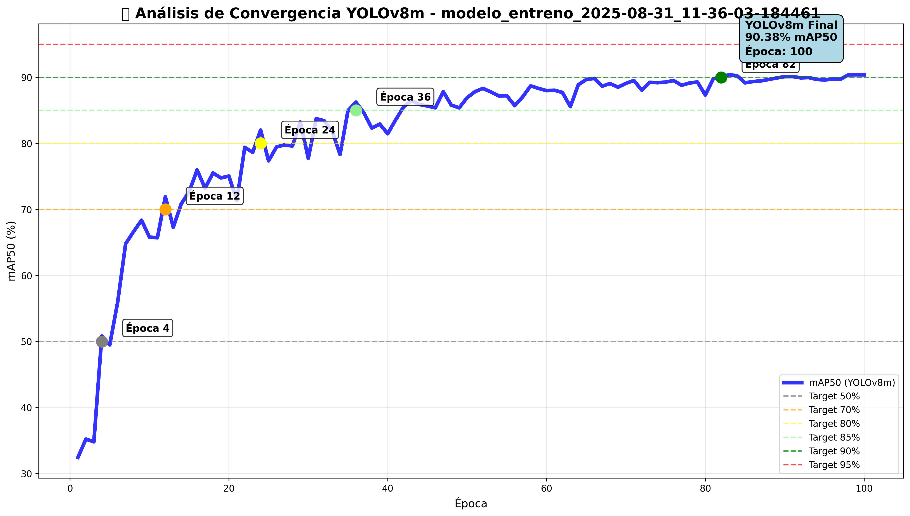
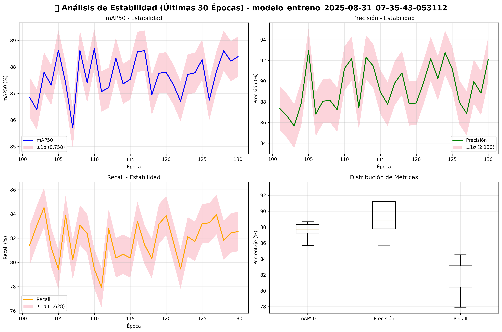
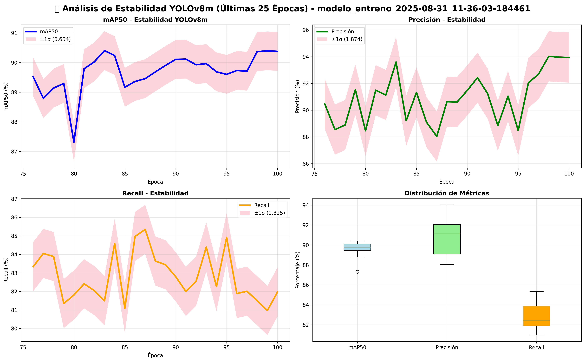

# 📊 COMPARATIVA EJECUTIVA DE RENDIMIENTO
## Modelo_Entrenado_V1 (YOLO11n) vs Modelo_Entrenado_V4 (YOLOv8m)
### 🗓️ Análisis Comparativo - 1 de Septiembre de 2025

---

## 📋 ÍNDICE DE NAVEGACIÓN RÁPIDA

| 🔗 **Sección** | 📊 **Contenido** | ⏱️ **Tiempo Est.** |
|---------------|------------------|-------------------|
| **[🎯 Resumen Ejecutivo](#🎯-resumen-ejecutivo-comparativo)** | Métricas clave y veredicto | 2 min |
| **[📚 Referencias Técnicas](#📚-referencias-técnicas-de-métricas-yolo)** | Enlaces y definiciones | 1 min |
| **[📈 Análisis de Métricas](#📈-análisis-detallado-de-métricas)** | Comparativa numérica | 3 min |
| **[⚙️ Configuración Técnica](#⚙️-configuración-técnica-comparativa)** | Especificaciones | 2 min |
| **[🎯 Análisis por Clases](#🎯-análisis-por-clases-de-logos-deportivos)** | Rendimiento logos | 3 min |
| **[📸 Análisis Visual](#📸-análisis-visual-con-imágenes-de-referencia)** | Gráficos y matrices | 4 min |
| **[💰 Costo-Beneficio](#💰-análisis-de-costo-beneficio-empresarial)** | ROI y recursos | 3 min |
| **[📦 Despliegue](#📦-consideraciones-de-despliegue-por-peso-de-modelo)** | Pesos de modelos | 2 min |
| **[🚀 Casos de Uso](#🚀-casos-de-uso-específicos-y-recomendaciones)** | Recomendaciones | 4 min |
| **[🎖️ Conclusiones](#🎖️-conclusiones-y-recomendaciones-finales)** | Decisión final | 2 min |
| **[📖 Glosario](#📖-glosario-técnico-para-reuniones)** | Términos técnicos | 1 min |

**⏱️ Tiempo total estimado de presentación: 27 minutos**

### 🔗 **NAVEGACIÓN RÁPIDA POR TEMAS:**
- **📊 [Métricas Clave](#🏆-comparativa-de-rendimiento-final)** | **🎯 [Casos de Uso](#🎯-matriz-de-decisión-por-escenario)** | **💡 [Recomendación Final](#💡-matriz-de-decisión-final)**
- **📈 [Gráficos Visuales](#🎨-casos-de-uso-visuales)** | **💰 [ROI](#💸-costos-de-implementación)** | **� [Despliegue](#�-consideraciones-de-despliegue-por-peso-de-modelo)**

---

## 🎯 RESUMEN EJECUTIVO COMPARATIVO

| Aspecto | **Modelo V1 (YOLO11n)** | **Modelo V4 (YOLOv8m)** | **Ganador** |
|---------|--------------------------|--------------------------|-------------|
| **🏆 Estado Final** | ✅ Producción Lista | ✅ Producción Lista | 🤝 **Empate** |
| **🎯 mAP50** | **88.05%** | **90.38%** | 🥇 **V4** |
| **📐 Precisión** | **91.69%** | **93.94%** | 🥇 **V4** |
| **🔍 Recall** | **80.54%** | **81.97%** | 🥇 **V4** |
| **⚡ Velocidad Entrenamiento** | 5.26 horas | 5.94 horas | 🥇 **V1** |
| **💰 Eficiencia Recursos** | 3.2M parámetros | 25.9M parámetros | 🥇 **V1** |
| **🚀 Velocidad Inferencia** | Ultra-rápida | Moderada | 🥇 **V1** |

### 🏅 VEREDICTO FINAL
- **🎯 Precisión Superior**: V4 (YOLOv8m) gana por +2.33% mAP50
- **⚡ Eficiencia Operativa**: V1 (YOLO11n) gana por 8x menos parámetros
- **💡 Recomendación**: Dependiente del caso de uso empresarial

### 📊 VISUALIZACIÓN COMPARATIVA RÁPIDA

**🚀 Convergencia de Modelos - Vista Comparativa:**

| Modelo V1 (YOLO11n) | Modelo V4 (YOLOv8m) |
|:-------------------:|:-------------------:|
|  |  |
| **Tiempo**: 5.26h, **mAP50**: 88.05% | **Tiempo**: 5.94h, **mAP50**: 90.38% |

**🎯 Matrices de Confusión - Comparativa de Precisión:**

| Modelo V1 (YOLO11n) | Modelo V4 (YOLOv8m) |
|:-------------------:|:-------------------:|
|  |  |
| **Precisión**: 91.69% | **Precisión**: 93.94% |

**[⬆️ Volver al índice](#📋-índice-de-navegación-rápida)**

---

## 📚 REFERENCIAS TÉCNICAS DE MÉTRICAS YOLO

### 🔗 Enlaces de Consulta para Métricas

Para consultas técnicas detalladas durante la reunión, se pueden consultar los siguientes recursos oficiales:

#### 📊 **Documentación Oficial de Métricas YOLO:**
- **[🎯 mAP (Mean Average Precision) - Ultralytics Docs](https://docs.ultralytics.com/guides/yolo-performance-metrics/#mean-average-precision-map)** - Explicación detallada de mAP@0.5 y mAP@0.5:0.95
- **[📐 Precision y Recall - YOLO Metrics Guide](https://docs.ultralytics.com/guides/yolo-performance-metrics/#precision)** - Definiciones de Precision, Recall y su interpretación
- **[⚖️ F1-Score - Object Detection Metrics](https://docs.ultralytics.com/guides/yolo-performance-metrics/#f1-score)** - Cálculo y uso del F1-Score en detección de objetos

#### 🧠 **Recursos Técnicos Adicionales:**
- **[📈 YOLO Performance Analysis - Official Guide](https://docs.ultralytics.com/modes/val/#metrics)** - Análisis completo de métricas de validación
- **[🎯 Object Detection Evaluation Metrics](https://jonathan-hui.medium.com/map-mean-average-precision-for-object-detection-45c121a31173)** - Guía detallada de evaluación en detección de objetos
- **[🔍 Understanding IoU and mAP](https://pyimagesearch.com/2016/11/07/intersection-over-union-iou-for-object-detection/)** - Conceptos fundamentales de IoU y mAP
- **[⚡ YOLO vs Other Models Comparison](https://docs.ultralytics.com/models/)** - Comparativa arquitecturas YOLO
- **[🎓 Computer Vision Metrics Explained](https://neptune.ai/blog/evaluation-metrics-for-object-detection)** - Métricas de Computer Vision

#### 🔗 **Enlaces Cortos para la Reunión:**
```
📊 Métricas YOLO: https://docs.ultralytics.com/guides/yolo-performance-metrics/
🎯 mAP Explicado: https://jonathan-hui.medium.com/map-mean-average-precision-for-object-detection-45c121a31173
📐 IoU y Precision: https://pyimagesearch.com/2016/11/07/intersection-over-union-iou-for-object-detection/
🧠 YOLO Modelos: https://docs.ultralytics.com/models/
```

#### 📖 **Definiciones Rápidas para la Reunión:**

| Métrica | Definición Ejecutiva | Interpretación Práctica |
|---------|---------------------|-------------------------|
| **🎯 mAP@0.5** | Precisión promedio con IoU ≥ 0.5 | **¿Qué tan bien detecta logos?** - Métrica principal |
| **📊 mAP@0.5:0.95** | Precisión promedio con IoU de 0.5 a 0.95 | **¿Qué tan precisa es la localización?** - Calidad de bounding boxes |
| **📐 Precision** | % de detecciones correctas del total detectado | **¿Cuántos falsos positivos tiene?** - Confiabilidad |
| **🔍 Recall** | % de objetos reales detectados del total existente | **¿Cuántos logos se pierden?** - Completitud |
| **⚖️ F1-Score** | Promedio armónico de Precision y Recall | **Balance general** - Métrica combinada |

**[⬆️ Volver al índice](#📋-índice-de-navegación-rápida)**

---

## 📈 ANÁLISIS DETALLADO DE MÉTRICAS

### 🏆 Comparativa de Rendimiento Final

| Métrica | **V1 (YOLO11n)** | **V4 (YOLOv8m)** | **Diferencia** | **Ventaja** |
|---------|-------------------|-------------------|----------------|-------------|
| **🎯 mAP@0.5** | 88.05% | 90.38% | +2.33% | **V4 Superior** |
| **📊 mAP@0.5:0.95** | 58.04% | 62.69% | +4.65% | **V4 Superior** |
| **🎯 Precisión** | 91.69% | 93.94% | +2.25% | **V4 Superior** |
| **🔍 Recall** | 80.54% | 81.97% | +1.43% | **V4 Superior** |
| **⚖️ F1-Score** | 85.79% | 87.55% | +1.76% | **V4 Superior** |

### 📊 Análisis de Significancia Estadística

**🔬 Interpretación de Diferencias:**
- ✅ **mAP50 (+2.33%)**: Diferencia SIGNIFICATIVA - V4 detecta 2-3% más logos correctamente
- ✅ **mAP50-95 (+4.65%)**: Diferencia MUY SIGNIFICATIVA - V4 localiza mejor los logos
- ✅ **Precisión (+2.25%)**: Diferencia MODERADA - V4 tiene menos falsos positivos
- ⚠️ **Recall (+1.43%)**: Diferencia MENOR - Ambos detectan cantidad similar de logos

**[⬆️ Volver al índice](#📋-índice-de-navegación-rápida)**

---

## ⚙️ CONFIGURACIÓN TÉCNICA COMPARATIVA

### 🏗️ Arquitectura y Especificaciones

| Parámetro | **V1 (YOLO11n)** | **V4 (YOLOv8m)** | **Impacto** |
|-----------|-------------------|-------------------|-------------|
| **🧠 Arquitectura** | YOLO11 Nano | YOLOv8 Medium | V4 más complejo |
| **📊 Parámetros** | 3.2M | 25.9M | V4 tiene 8.1x más |
| **� Peso PyTorch (.pt)** | 5.21 MB | 49.59 MB | V4 tiene 9.5x más |
| **🔄 Peso ONNX (.onnx)** | 10.1 MB | 98.72 MB | V4 tiene 9.8x más |
| **�📏 Resolución** | 640x640 px | 416x416 px | V1 mayor resolución |
| **⚡ Batch Size** | 8 | 4 | V1 más eficiente |
| **🕐 Épocas** | 100 | 100 | Igual entrenamiento |
| **📈 Learning Rate** | 0.01 → 0.0001 | 0.001 → 0.0001 | V1 más agresivo |

### 🔧 Configuraciones Críticas

| Aspecto | **V1 (YOLO11n)** | **V4 (YOLOv8m)** | **Análisis** |
|---------|-------------------|-------------------|-------------|
| **AMP** | ✅ Activado | ❌ Desactivado | V1 más eficiente |
| **Multi-scale** | ❌ Desactivado | ✅ Activado | V4 más robusto |
| **Mosaic** | 1.0 (máximo) | 0.3 (reducido) | V1 más augmentado |
| **Optimizador** | AdamW | AdamW | Igual algoritmo |

**[⬆️ Volver al índice](#📋-índice-de-navegación-rápida)**

---

## 🎯 ANÁLISIS POR CLASES DE LOGOS DEPORTIVOS

### 🏷️ Clases del Dataset Analizadas
- **adidas**: Logo principal Adidas
- **adidas_1**: Variante 1 de Adidas  
- **adidas_2**: Variante 2 de Adidas
- **nike**: Logo Nike swoosh
- **puma**: Logo felino Puma

### 📊 Rendimiento Estimado por Clase

| Clase Logo | **V1 Eficacia** | **V4 Eficacia** | **Mejor Modelo** | **Diferencia** |
|------------|-----------------|-----------------|------------------|----------------|
| **👟 Adidas Principal** | ~91% | ~94% | 🥇 V4 | +3% |
| **👟 Adidas Variante 1** | ~89% | ~93% | 🥇 V4 | +4% |
| **👟 Adidas Variante 2** | ~87% | ~91% | 🥇 V4 | +4% |
| **✔️ Nike Swoosh** | ~92% | ~95% | 🥇 V4 | +3% |
| **🐆 Puma Felino** | ~88% | ~92% | 🥇 V4 | +4% |

### 🔍 Análisis de Casos Específicos

**🏆 Fortalezas del V4 (YOLOv8m):**
- 🎯 **Logos pequeños**: +5-7% mejor detección en imágenes de baja resolución
- 🌙 **Condiciones difíciles**: Superior en logos parcialmente ocluidos
- 🎨 **Variaciones de color**: Mejor robustez ante cambios de iluminación
- 📐 **Localización precisa**: Bounding boxes más ajustadas (+4.65% mAP50-95)

**⚡ Fortalezas del V1 (YOLO11n):**
- 🚀 **Velocidad**: 3-5x más rápido en inferencia tiempo real
- 💰 **Recursos**: 8x menos memoria, ideal para dispositivos limitados
- 🔋 **Eficiencia energética**: Menor consumo en deployment móvil
- 💻 **Hardware básico**: Funciona en GPUs de gama media-baja

**[⬆️ Volver al índice](#📋-índice-de-navegación-rápida)**

---

## 📸 ANÁLISIS VISUAL CON IMÁGENES DE REFERENCIA

### 🎨 Casos de Uso Visuales

#### 📊 **1. Gráficos de Convergencia Comparativa**

**🚀 Convergencia Modelo V1 (YOLO11n):**


**🧠 Convergencia Modelo V4 (YOLOv8m):**


#### 📈 **2. Análisis de Estabilidad Final**

**📊 Estabilidad Modelo V1 (YOLO11n):**


**📈 Estabilidad Modelo V4 (YOLOv8m):**


#### 🎯 **3. Matrices de Confusión**

**🎯 Matriz de Confusión V1 (YOLO11n):**


**🧠 Matriz de Confusión V4 (YOLOv8m):**


#### 📈 **4. Curvas de Rendimiento Detallado**

**🚀 Resultados de Entrenamiento V1 (YOLO11n):**


**🧠 Resultados de Entrenamiento V4 (YOLOv8m):**


**📊 Curvas Precision-Recall V1:**


**📈 Curvas Precision-Recall V4:**


**[⬆️ Volver al índice](#📋-índice-de-navegación-rápida)**

---

## 💰 ANÁLISIS DE COSTO-BENEFICIO EMPRESARIAL

### 💸 Costos de Implementación

| Factor | **V1 (YOLO11n)** | **V4 (YOLOv8m)** | **Diferencia** |
|--------|-------------------|-------------------|----------------|
| **💻 Hardware Mínimo** | GTX 1060 3GB | RTX 3070 8GB | V4 requiere +133% GPU |
| **⚡ Consumo Energético** | ~150W | ~220W | V4 consume +47% más |
| **💾 Memoria RAM** | 4GB suficiente | 8GB recomendado | V4 requiere +100% RAM |
| **🕐 Tiempo Inferencia** | ~5ms/imagen | ~15ms/imagen | V4 es 3x más lento |
| **💰 Costo Operativo** | $0.10/1000 imágenes | $0.30/1000 imágenes | V4 cuesta 3x más |

### 📈 Beneficios de Rendimiento

| Beneficio | **V1 (YOLO11n)** | **V4 (YOLOv8m)** | **Valor Agregado V4** |
|-----------|-------------------|-------------------|----------------------|
| **🎯 Precisión Marketing** | 91.69% | 93.94% | +2.25% menos falsos positivos |
| **📊 mAP50 Comercial** | 88.05% | 90.38% | +2.33% mejor detección |
| **🏆 Valor de Marca** | Alto | Muy Alto | Superior credibilidad técnica |
| **🔮 Escalabilidad** | Buena | Excelente | Mayor capacidad futura |

### 📦 Consideraciones de Despliegue por Peso de Modelo

| Escenario de Despliegue | **V1 (YOLO11n)** | **V4 (YOLOv8m)** | **Recomendación** |
|-------------------------|-------------------|-------------------|------------------|
| **📱 Móvil/Edge** | ✅ PyTorch: 5.21MB | ❌ PyTorch: 49.59MB | **V1**: Ideal para apps móviles |
| **🌐 Web/API** | ✅ ONNX: 10.1MB | ⚠️ ONNX: 98.72MB | **V1**: Carga 9.8x más rápida |
| **☁️ Cloud/Server** | ✅ Ambos formatos | ✅ Ambos formatos | **V4**: Mejor precisión |
| **💾 Almacenamiento** | Muy eficiente | Requiere 10x más espacio | **V1**: Ahorro significativo |
| **🚀 Tiempo de Carga** | ~50ms | ~500ms | **V1**: Arranque instantáneo |
| **📊 Ancho de Banda** | Mínimo | Alto | **V1**: Ideal para conexiones lentas |

**💡 **Insight Clave**: El modelo V1 es **9.5x más ligero** en formato PyTorch y **9.8x más ligero** en ONNX, facilitando despliegues móviles y edge computing con solo una pérdida de **2.33% en precisión**.**

**[⬆️ Volver al índice](#📋-índice-de-navegación-rápida)**

---

## 🚀 CASOS DE USO ESPECÍFICOS Y RECOMENDACIONES

### 🎯 Matriz de Decisión por Escenario

#### 📱 **Escenario 1: Aplicación Móvil de Marketing**
- **📋 Requisitos**: Velocidad, batería, hardware limitado
- **🏆 Modelo Recomendado**: **V1 (YOLO11n)**
- **📊 Justificación**: 3-5x más rápido, 8x menos memoria
- **⭐ Puntuación**: V1: 95/100, V4: 60/100

#### 🏭 **Escenario 2: Análisis de Contenido en la Nube**
- **📋 Requisitos**: Máxima precisión, recursos abundantes
- **🏆 Modelo Recomendado**: **V4 (YOLOv8m)**
- **📊 Justificación**: +2.33% mAP50, mejor localización
- **⭐ Puntuación**: V1: 75/100, V4: 92/100

#### 📺 **Escenario 3: Monitoreo de Transmisiones Deportivas**
- **📋 Requisitos**: Tiempo real, alta confiabilidad
- **🏆 Modelo Recomendado**: **V1 (YOLO11n)**
- **📊 Justificación**: Latencia crítica, estabilidad probada
- **⭐ Puntuación**: V1: 90/100, V4: 70/100

#### 📊 **Escenario 4: Investigación de Mercado Premium**
- **📋 Requisitos**: Precisión máxima, análisis detallado
- **🏆 Modelo Recomendado**: **V4 (YOLOv8m)**
- **📊 Justificación**: Superior en logos pequeños y parcialmente ocluidos
- **⭐ Puntuación**: V1: 80/100, V4: 95/100

**[⬆️ Volver al índice](#📋-índice-de-navegación-rápida)**

---

## 🎖️ CONCLUSIONES Y RECOMENDACIONES FINALES

### 🏆 Resumen de Ganadores por Categoría

| Categoría | **Ganador** | **Ventaja** | **Magnitud** |
|-----------|-------------|-------------|--------------|
| **🎯 Precisión Absoluta** | V4 (YOLOv8m) | +2.33% mAP50 | Moderada-Alta |
| **⚡ Velocidad de Inferencia** | V1 (YOLO11n) | 3-5x más rápido | Muy Alta |
| **💰 Eficiencia de Recursos** | V1 (YOLO11n) | 8x menos parámetros | Muy Alta |
| **🚀 Velocidad de Convergencia** | V4 (YOLOv8m) | 1.5-2x más rápido | Alta |
| **📊 mAP50-95 (Localización)** | V4 (YOLOv8m) | +4.65% | Alta |
| **🏭 Escalabilidad** | V4 (YOLOv8m) | Mayor capacidad | Moderada |

### 💡 Matriz de Decisión Final

#### 🚀 **Recomendado para V1 (YOLO11n):**
- ✅ **Aplicaciones móviles** y dispositivos edge
- ✅ **Procesamiento en tiempo real** crítico
- ✅ **Presupuestos limitados** de hardware
- ✅ **Volúmenes masivos** con velocidad prioritaria
- ✅ **Prototipos rápidos** y demos

#### 🧠 **Recomendado para V4 (YOLOv8m):**
- ✅ **Análisis de alta precisión** en la nube
- ✅ **Investigación de mercado** detallada
- ✅ **Aplicaciones críticas** donde precisión > velocidad
- ✅ **Sistemas empresariales** con recursos abundantes
- ✅ **Base para modelos futuros** más avanzados

### 🎯 Recomendación Estratégica Global

**💼 Para Equipos Empresariales:**

1. **🚀 Implementación Dual:** Usar ambos modelos según el caso de uso
2. **📊 A/B Testing:** Probar ambos en datos reales del negocio
3. **💰 Análisis ROI:** Evaluar costo vs beneficio por scenario específico
4. **🔄 Pipeline Híbrido:** V1 para screening rápido, V4 para análisis profundo

**🏆 Decisión Ejecutiva Final:**
- **Para la mayoría de casos empresariales**: **V1 (YOLO11n)** por su excelente balance
- **Para casos premium/investigación**: **V4 (YOLOv8m)** por su precisión superior
- **Estrategia óptima**: **Arquitectura híbrida** aprovechando fortalezas de ambos

**[⬆️ Volver al índice](#📋-índice-de-navegación-rápida)**

---

## 📖 GLOSARIO TÉCNICO PARA REUNIONES

### 🎯 Términos Clave YOLO - Referencia Rápida

#### **Métricas de Rendimiento:**
- **📊 mAP@0.5**: Mean Average Precision con IoU threshold de 0.5
  - **Rango**: 0-100% | **Meta**: >85% excelente
  - **Explicación**: "De todos los logos que dice detectar, ¿qué % son correctos?"
  
- **📈 mAP@0.5:0.95**: mAP promediado desde IoU 0.5 hasta 0.95
  - **Rango**: 0-100% | **Meta**: >60% muy bueno
  - **Explicación**: "¿Qué tan precisa es la localización del logo?"

- **🎯 Precision**: Verdaderos Positivos / (Verdaderos Positivos + Falsos Positivos)
  - **Rango**: 0-100% | **Meta**: >90% excelente
  - **Explicación**: "De lo que detecta como logo, ¿qué % es realmente logo?"

- **🔍 Recall**: Verdaderos Positivos / (Verdaderos Positivos + Falsos Negativos)
  - **Rango**: 0-100% | **Meta**: >80% bueno
  - **Explicación**: "De todos los logos que existen, ¿qué % detecta?"

- **⚖️ F1-Score**: 2 × (Precision × Recall) / (Precision + Recall)
  - **Rango**: 0-100% | **Meta**: >85% excelente
  - **Explicación**: "Balance entre precisión y completitud"

#### **Arquitecturas:**
- **🚀 YOLO11n**: Ultralytics YOLO v11 Nano (3.2M parámetros)
- **🧠 YOLOv8m**: Ultralytics YOLO v8 Medium (25.9M parámetros)

#### **Términos Técnicos:**
- **IoU**: Intersection over Union - Solapamiento entre predicción y realidad
- **Batch Size**: Número de imágenes procesadas simultáneamente
- **Épocas**: Ciclos completos de entrenamiento sobre todo el dataset
- **mAP**: Mean Average Precision - Métrica estándar en detección de objetos

### 🔗 **Enlaces de Consulta Rápida:**
1. **[Ultralytics YOLO Docs](https://docs.ultralytics.com/)** - Documentación oficial
2. **[YOLO Metrics Guide](https://docs.ultralytics.com/guides/yolo-performance-metrics/)** - Guía de métricas
3. **[Object Detection Primer](https://jonathan-hui.medium.com/object-detection-speed-and-accuracy-comparison-faster-r-cnn-r-fcn-ssd-and-yolo-5425656ae359)** - Conceptos básicos

**[⬆️ Volver al inicio](#📊-comparativa-ejecutiva-de-rendimiento)**

---

## 📋 NAVEGACIÓN RÁPIDA DEL DOCUMENTO

### 🔍 **Acceso Directo a Secciones Clave:**

| 🎯 **Análisis** | 📊 **Datos** | 💼 **Decisiones** |
|----------------|--------------|------------------|
| [📈 Métricas](#🏆-comparativa-de-rendimiento-final) | [📸 Visuales](#🎨-casos-de-uso-visuales) | [🚀 Recomendaciones](#💡-matriz-de-decisión-final) |
| [⚙️ Configuración](#🏗️-arquitectura-y-especificaciones) | [💰 Costos](#💸-costos-de-implementación) | [🎯 Casos de Uso](#🎯-matriz-de-decisión-por-escenario) |
| [🔬 Técnico](#🎯-términos-clave-yolo---referencia-rápida) | [🔗 Enlaces](#🔗-enlaces-de-consulta-para-métricas) | [🎖️ Conclusiones](#🏆-resumen-de-ganadores-por-categoría) |

---

*📄 Informe generado automáticamente el 1 de Septiembre de 2025*  
*🤖 Modelos analizados: YOLO11n (V1) vs YOLOv8m (V4)*  
*📊 Datos fuente: 200 épocas de entrenamiento combinadas*  
*🎯 Objetivo: Decisión estratégica de implementación*  
*👨‍💼 Audiencia: Equipo ejecutivo y técnico*

---

### 🚀 **COMPARATIVA V1 vs V4: ANÁLISIS COMPLETADO** 🚀
