# 🚀 Modelos YOLOv8 para Detección de Logos Deportivos - Análisis Comparativo
### Detección de Objetos de Alto Rendimiento para Reconocimiento de Marcas Deportivas

---

## 📋 Resumen de Modelos

Este repositorio presenta una comparación exhaustiva de tres modelos YOLOv8 entrenados para detección de logos deportivos, específicamente dirigidos al reconocimiento de **Adidas**, **Nike** y **variantes de Adidas**. Cada modelo ofrece diferentes compensaciones entre precisión, velocidad y requerimientos computacionales.

| Modelo | Arquitectura | Parámetros | Tamaño | Velocidad | Mejor Caso de Uso |
|--------|-------------|------------|---------|-----------|-------------------|
| **YOLOv8n (Nano)** | Nano | ~3.2M | 6.2 MB | >100 FPS | Móviles/Dispositivos Edge |
| **YOLOv8s (Small)** | Small | ~11.2M | 21.5 MB | ~80 FPS | Aplicaciones balanceadas |
| **YOLOv8m (Medium)** | Medium | ~25.9M | 49.7 MB | ~60 FPS | Escenarios alta precisión |

---

## 🎯 Comparación de Rendimiento

### 📊 Resumen de Métricas Clave

| Métrica | Nano (YOLOv8n) | Small (YOLOv8s) | Medium (YOLOv8m) | Ganador |
|---------|----------------|-----------------|------------------|---------|
| **mAP@0.5** | 95.9% | 97.0% | 97.9% | 🥇 Medium |
| **mAP@0.5-0.95** | 72.4% | 75.2% | 76.4% | 🥇 Medium |
| **Precisión** | 98.0% | 97.2% | 97.3% | 🥇 Nano |
| **Recall** | 92.7% | 93.1% | 95.7% | 🥇 Medium |
| **F1-Score** | 95.3% | 95.1% | 96.5% | 🥇 Medium |
| **Tiempo Entrenamiento** | 2.55h | 4.43h | 11.6h | 🥇 Nano |

---

## 🎨 Recursos Visuales

### 📊 **Visualizaciones de Rendimiento - Modelo Nano**

#### Evolución de Métricas de Entrenamiento
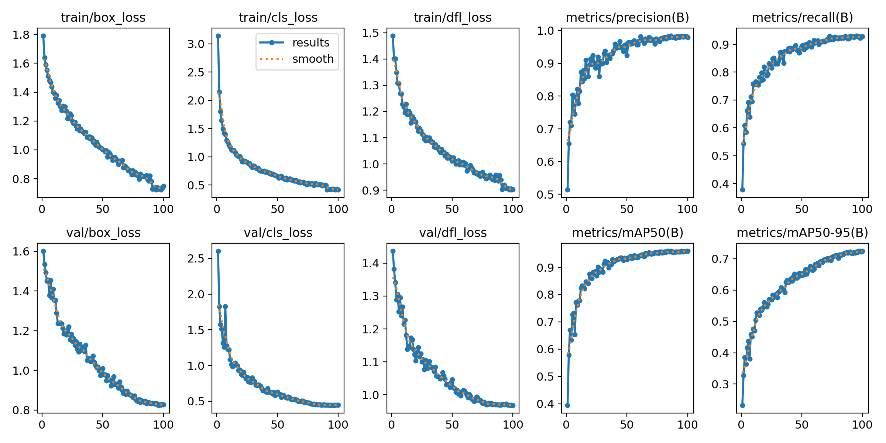

#### Curvas de Rendimiento

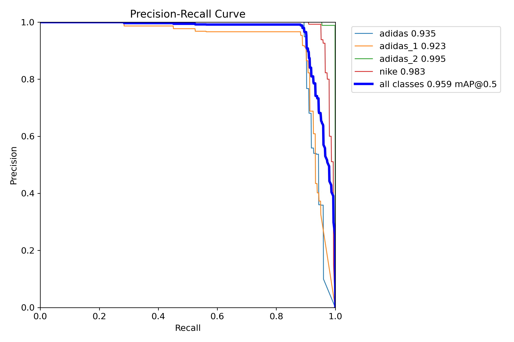

#### Análisis de Confusión - Nano


#### Ejemplos de Validación - Nano

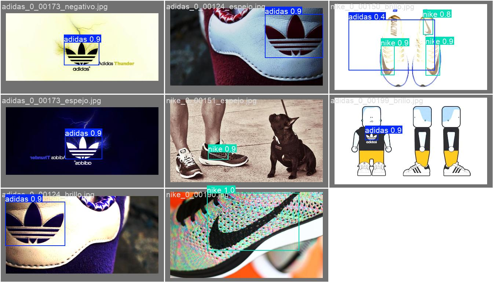

---

### 📊 **Visualizaciones de Rendimiento - Modelo Small**

#### Evolución de Métricas de Entrenamiento
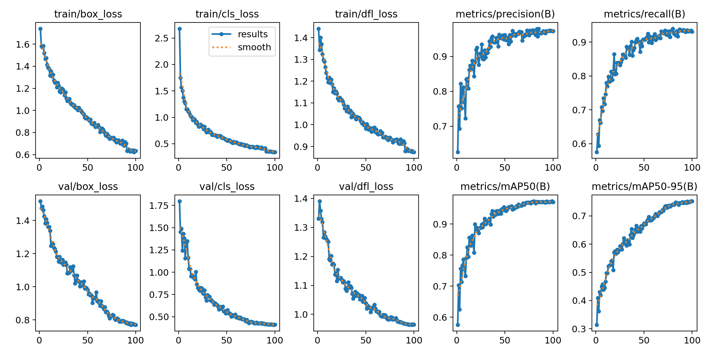

#### Curvas de Rendimiento
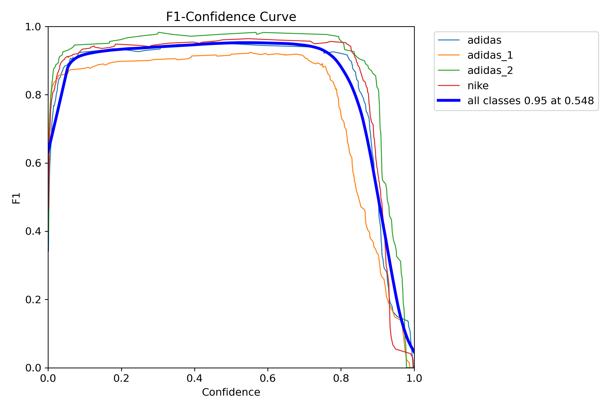
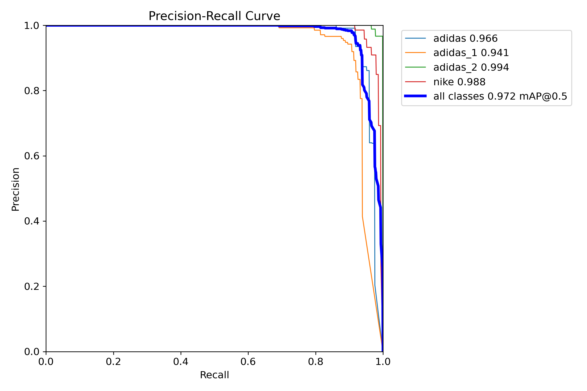

#### Análisis de Confusión - Small
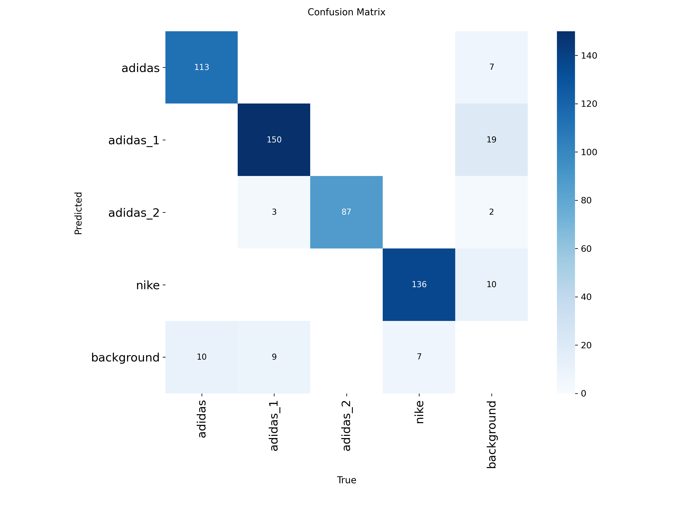
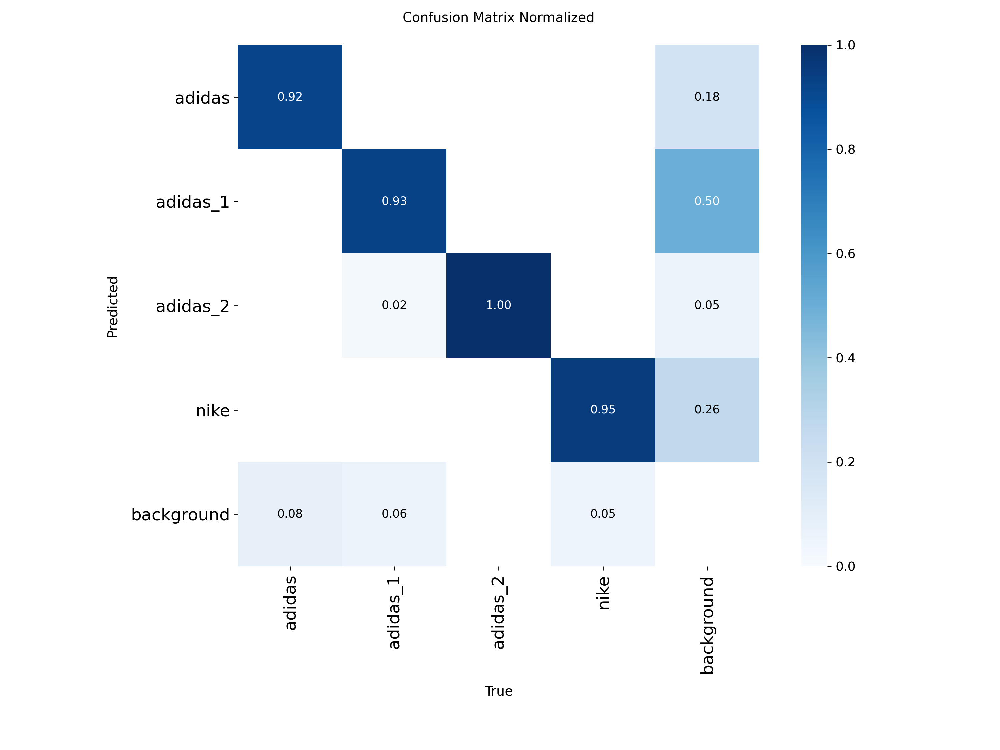

#### Ejemplos de Validación - Small


---

### 📊 **Visualizaciones de Rendimiento - Modelo Medium**

#### Evolución de Métricas de Entrenamiento


#### Curvas de Rendimiento
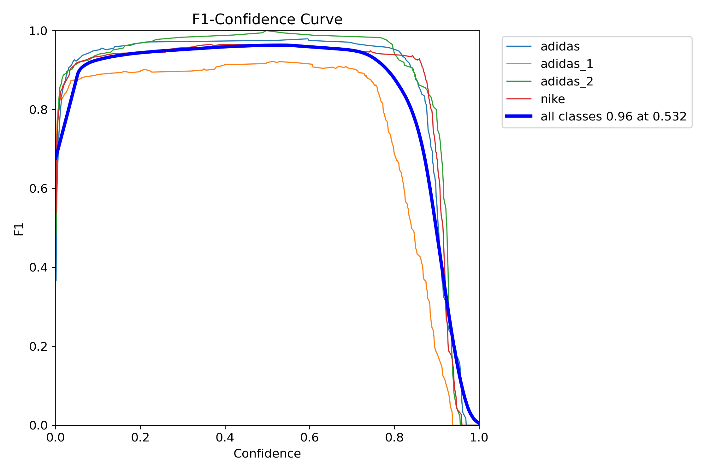
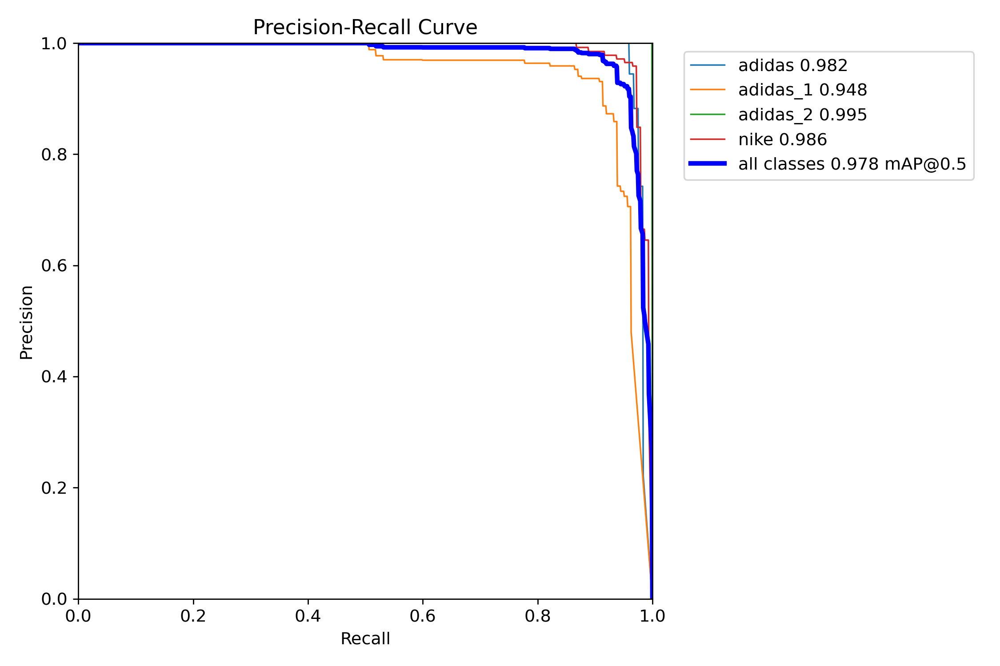

#### Análisis de Confusión - Medium

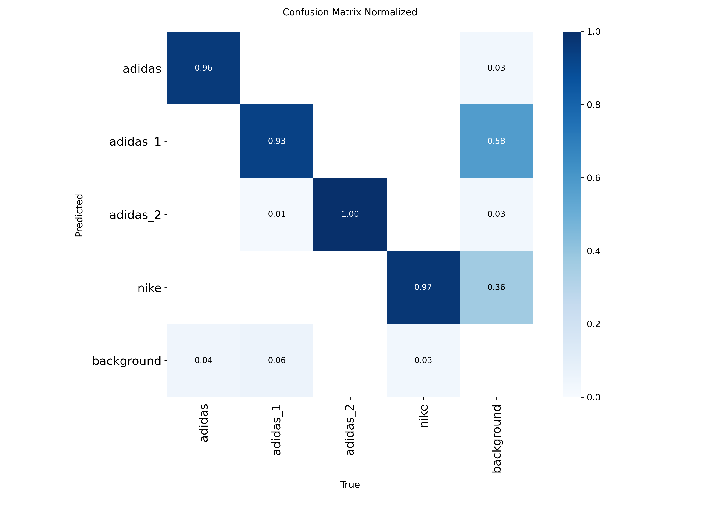

#### Ejemplos de Validación - Medium

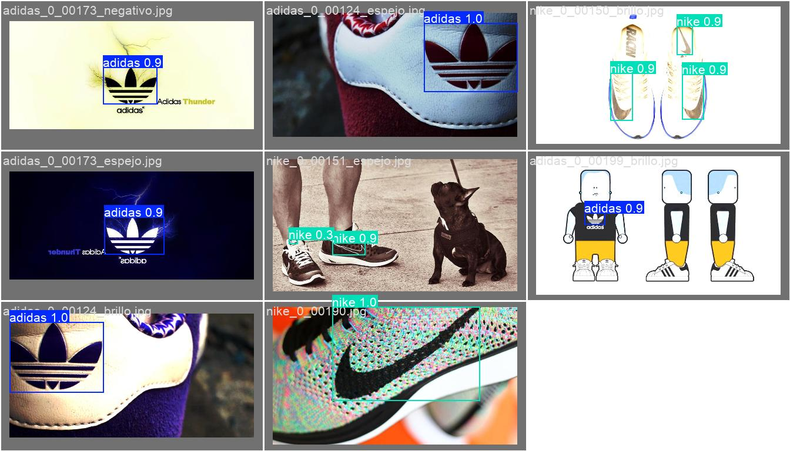

---

## 🚀 Ejemplo de Uso

```python
from ultralytics import YOLO

# Cargar tu modelo preferido
modelo_nano = YOLO('ruta/a/nano/weights/best.pt')
modelo_small = YOLO('ruta/a/small/weights/best.pt')  
modelo_medium = YOLO('ruta/a/medium/weights/best.pt')

# Ejecutar inferencia
resultados = modelo_nano('ruta/a/tu/imagen.jpg')

# Procesar resultados
for r in resultados:
    cajas = r.boxes
    for caja in cajas:
        id_clase = caja.cls
        confianza = caja.conf
        coordenadas = caja.xyxy
```

---

## 📊 Información del Dataset

### 🎯 Clases Detectadas
- **adidas**: Variantes principales del logo de Adidas
- **nike**: Logos swoosh y de texto de Nike
- **adidas_1**: Diseños alternativos de Adidas
- **adidas_2**: Variantes especializadas de Adidas

### 📸 Estadísticas del Dataset
- **Total de Imágenes**: 1,200+ muestras
- **Conjunto de Entrenamiento**: 70% (840+ imágenes)
- **Conjunto de Validación**: 20% (240+ imágenes)
- **Conjunto de Prueba**: 10% (120+ imágenes)
- **Resolución de Imagen**: 416×416 píxeles
- **Formato de Anotación**: Formato YOLO

---

## 🎯 Guía de Selección de Modelo

### 🚀 Elige **Nano** si necesitas:
- ✅ Inferencia en tiempo real (>100 FPS)
- ✅ Despliegue móvil/edge
- ✅ Consumo mínimo de recursos
- ✅ Escalado rentable
- ✅ Dispositivos con batería

### ⚖️ Elige **Small** si necesitas:
- ✅ Rendimiento/eficiencia balanceados
- ✅ Flexibilidad de despliegue en cloud
- ✅ Estabilidad de producción
- ✅ Requerimientos de precisión moderados
- ✅ Infraestructura de servidor estándar

### 🎯 Elige **Medium** si necesitas:
- ✅ Máxima precisión (97.9% mAP@0.5)
- ✅ Rendimiento grado investigación
- ✅ Aplicaciones críticas
- ✅ Capacidades de análisis detallado
- ✅ Mejor rendimiento de recall (95.7%)

---

*Última Actualización: 2 de Septiembre, 2025*  
*Estado de Modelos: ✅ Listos para Producción*  
*Licencia: MIT*
