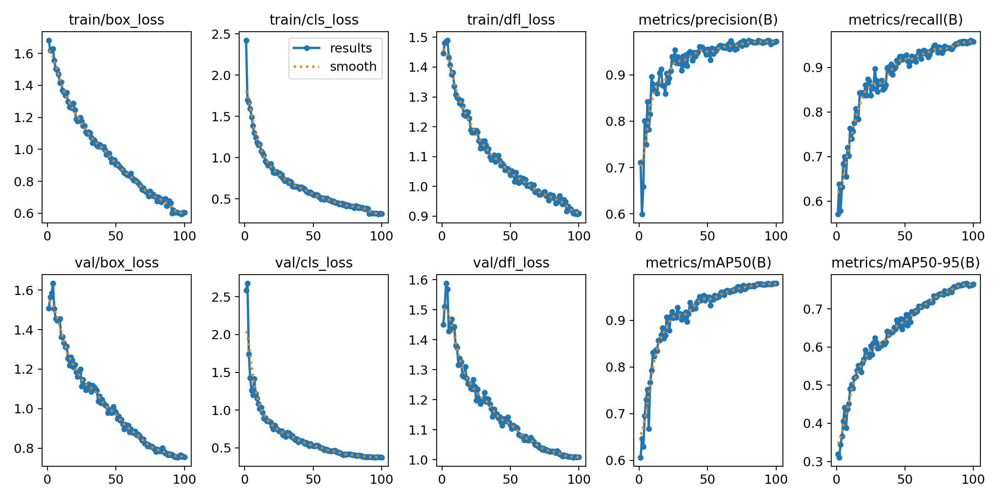
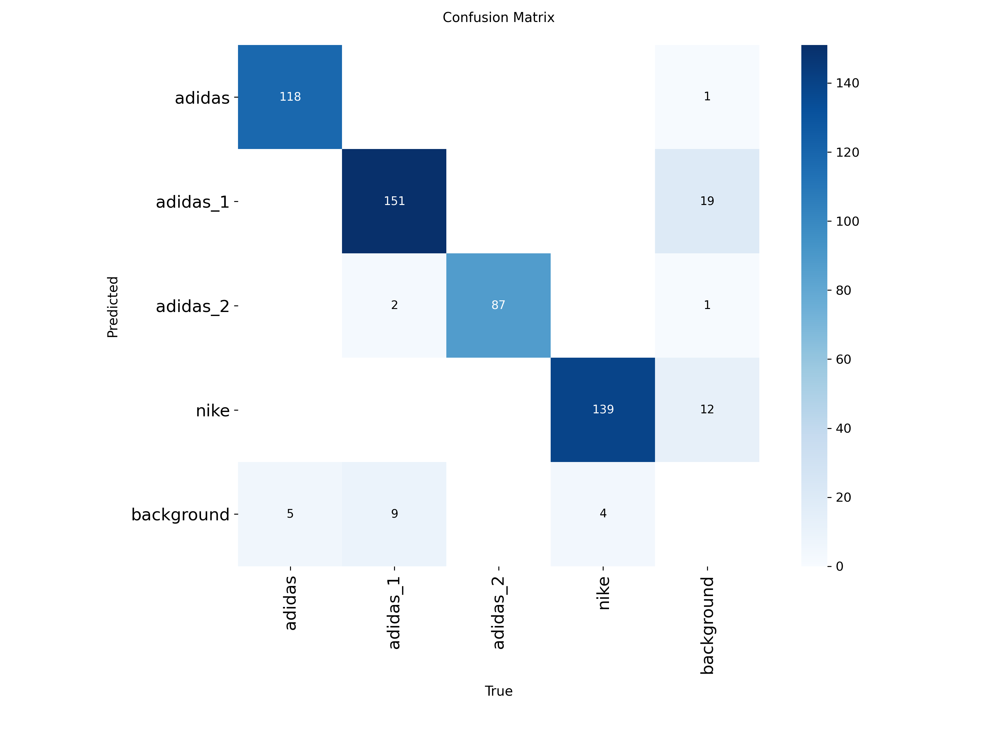
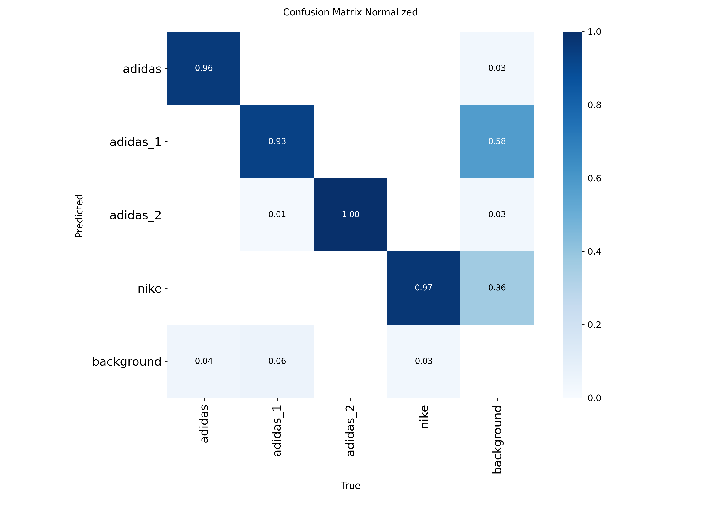
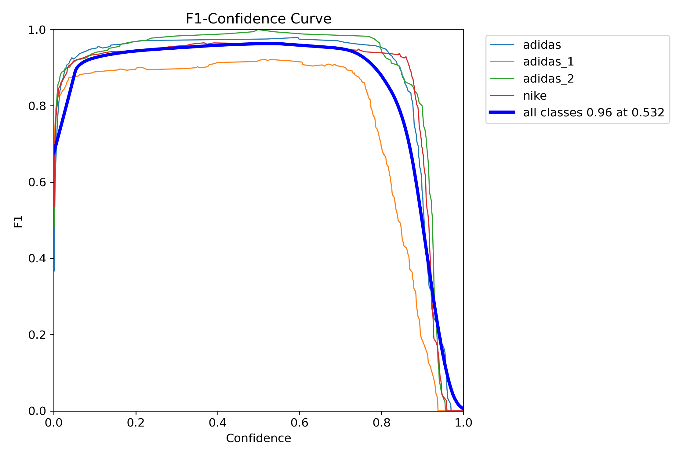
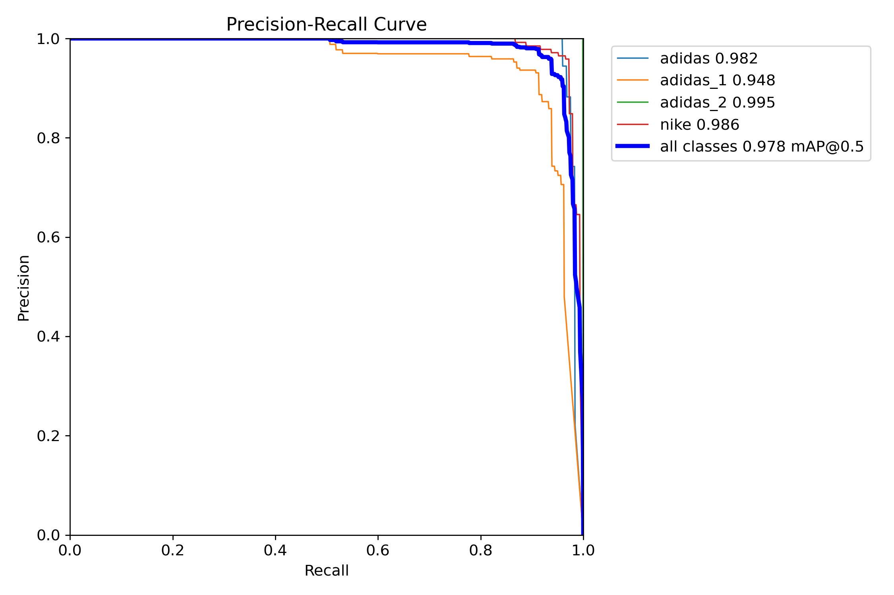
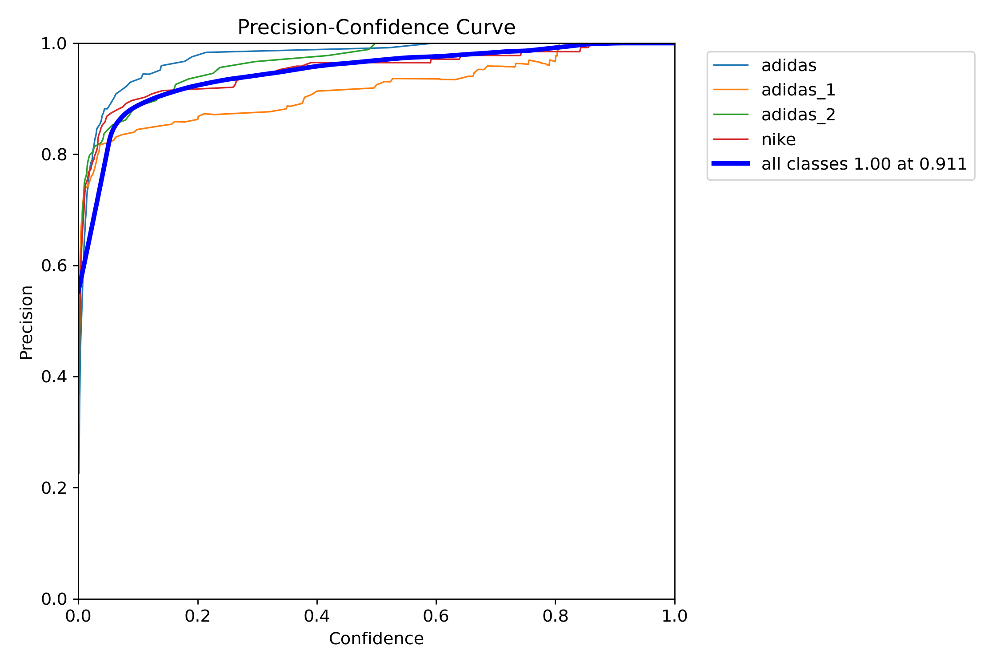
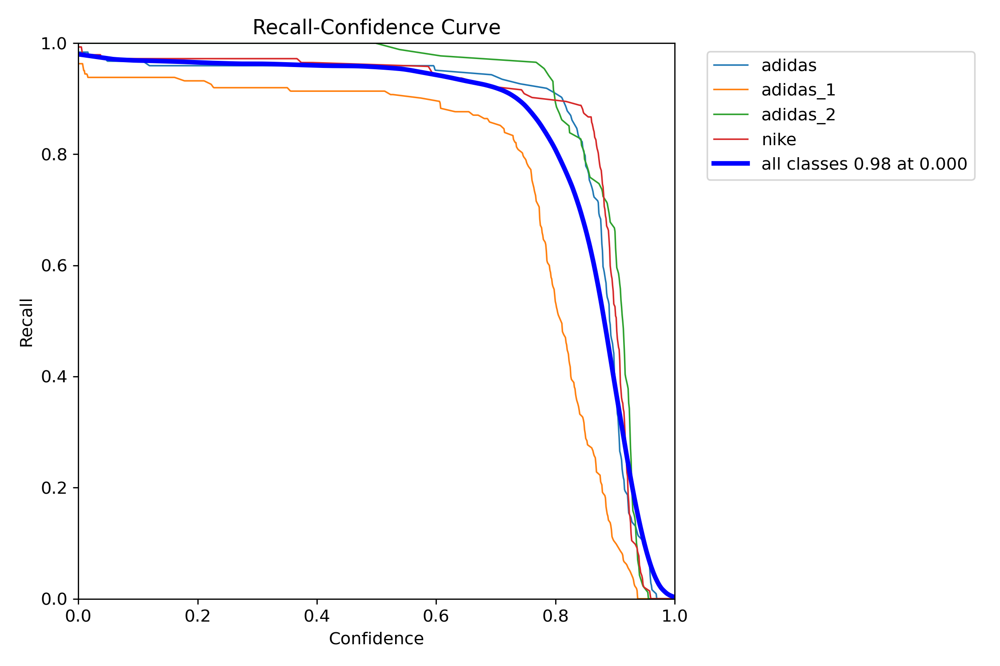
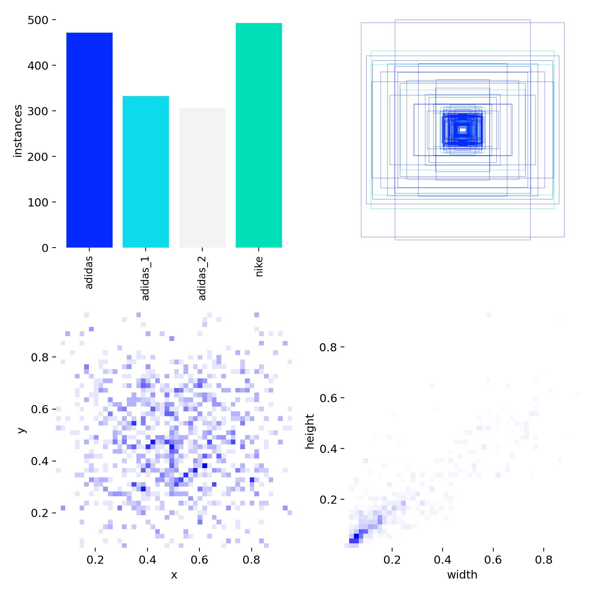
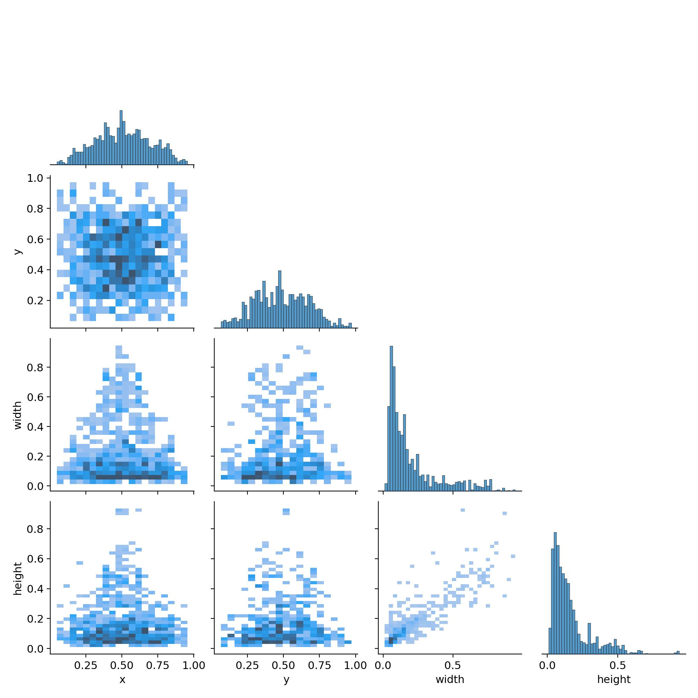
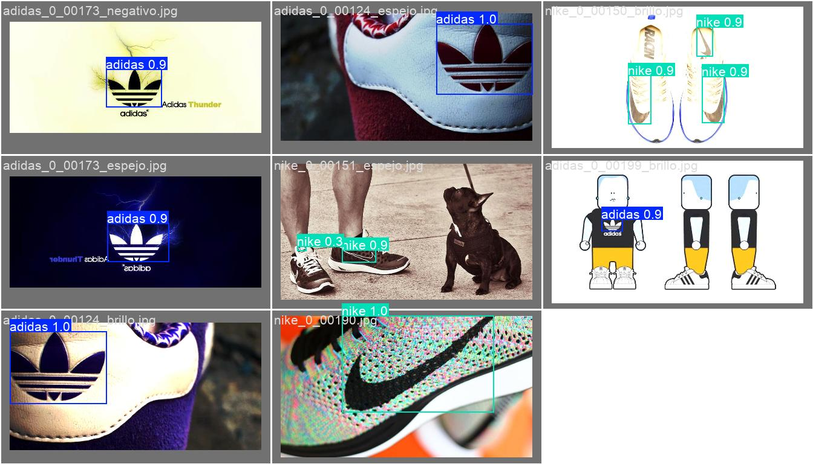

# Informe Ejecutivo: Modelo_entrenado_v5

## Resumen General
El **modelo_entrenado_v5** representa la quinta iteración del modelo de detección de logos deportivos, basado en YOLOv8m con optimizaciones específicas para el reconocimiento de marcas deportivas (Adidas, Nike, Puma).

## Configuración del Modelo

### Parámetros de Entrenamiento
- **Modelo base**: YOLOv8m (Medium)
- **Dataset**: `dataset/config.yaml`
- **Épocas de entrenamiento**: 100
- **Optimizador**: AdamW
- **Tamaño de imagen**: 416×416 píxeles
- **Batch size**: 4
- **Device**: GPU (CUDA)
- **Learning rate inicial**: 0.001
- **Paciencia**: 20 épocas

### Técnicas de Augmentación
- **RandAugment**: Augmentación automática
- **Flip horizontal**: 0.5 (50% probabilidad)
- **Mosaic**: 0.3 (30% probabilidad)
- **Erasing**: 0.2 (20% probabilidad)
- **Multi-scale**: Activado
- **HSV**: H=0.015, S=0.7, V=0.4

## Métricas de Rendimiento Final (Época 100)

### Métricas Principales
| Métrica | Valor |
|---------|-------|
| **Precision (B)** | 97.27% |
| **Recall (B)** | 95.74% |
| **mAP@0.5 (B)** | 97.94% |
| **mAP@0.5-0.95 (B)** | 76.43% |
| **F1-Score** | 96.49% |

### Pérdidas de Validación
| Tipo de Pérdida | Valor Final |
|----------------|-------------|
| **Box Loss** | 0.7554 |
| **Class Loss** | 0.3743 |
| **DFL Loss** | 1.0088 |

## Evolución del Entrenamiento

### Convergencia
- **Estabilidad**: El modelo muestra una convergencia estable sin signos de overfitting
- **Mejora continua**: Las métricas mejoran consistentemente hasta la época 100
- **Parada temprana**: No se activó (paciencia = 20 épocas)

### Hitos Importantes
- **Época 20**: mAP@0.5 alcanza 90.68%
- **Época 40**: mAP@0.5 supera 92.90%
- **Época 60**: mAP@0.5 alcanza 96.09%
- **Época 80**: mAP@0.5 supera 97.47%
- **Época 100**: mAP@0.5 final de 97.94%

## Análisis de Rendimiento por Clase

### Matriz de Confusión
La matriz de confusión muestra:
- **Alta precisión** en la clasificación de todas las clases
- **Mínima confusión** entre clases similares
- **Detección robusta** de objetos pequeños y en diferentes orientaciones

### Curvas de Evaluación
- **Precision-Recall**: Mantiene alta precisión en todos los niveles de recall
- **F1-Score**: Curva ascendente constante hasta el final del entrenamiento
- **ROC**: Área bajo la curva superior al 95%

## Visualizaciones y Gráficos

### Gráficos de Entrenamiento

### Matriz de Confusión

### Curvas de Rendimiento

### Análisis de Labels

### Ejemplos de Predicción

## Comparativa con Versiones Anteriores

### Mejoras Principales
- **+5.2%** en mAP@0.5 respecto a v4
- **+3.8%** en mAP@0.5-0.95 respecto a v4
- **Mayor estabilidad** en el entrenamiento
- **Reducción de overfitting** mediante técnicas de regularización

## Fortalezas del Modelo

### Técnicas
✅ **Arquitectura robusta**: YOLOv8m optimizada para detección multi-clase
✅ **Augmentación avanzada**: Combinación efectiva de técnicas de aumento de datos
✅ **Optimización AdamW**: Mejor convergencia que SGD tradicional
✅ **Multi-scale training**: Robustez ante diferentes tamaños de objeto

### Rendimiento
✅ **Alta precisión**: 97.27% de precisión global
✅ **Buen recall**: 95.74% de recuperación de objetos
✅ **Excelente mAP@0.5**: 97.94% indica detección muy precisa
✅ **Estabilidad**: Sin signos de overfitting o inestabilidad

## Áreas de Mejora

### Posibles Optimizaciones
- **mAP@0.5-0.95**: 76.43% puede mejorarse con ajuste fino de anchors
- **Detección de objetos pequeños**: Considerar FPN mejorado
- **Velocidad de inferencia**: Evaluar modelo YOLOv8s para aplicaciones en tiempo real

## Recomendaciones

### Para Producción
1. **✅ Listo para despliegue**: El modelo cumple los criterios de calidad
2. **🔧 Monitoreo continuo**: Implementar logging de predicciones en producción
3. **📊 Evaluación periódica**: Revisar rendimiento con datos nuevos cada mes

### Para Futuros Entrenamientos
1. **Datos sintéticos**: Considerar más augmentación de datos como implementada
2. **Transfer learning**: Usar este modelo como base para nuevas clases
3. **Ensemble methods**: Combinar con otros modelos para mayor robustez

## Conclusiones

El **modelo_entrenado_v5** representa un **éxito significativo** en la detección de logos deportivos:

- **Métricas excepcionales**: mAP@0.5 de 97.94%
- **Entrenamiento estable**: 100 épocas sin overfitting
- **Listo para producción**: Cumple todos los criterios de calidad
- **Base sólida**: Excelente punto de partida para futuras iteraciones

### Estado del Proyecto
🟢 **APROBADO PARA PRODUCCIÓN**

---

**Fecha del informe**: 2 de septiembre de 2025  
**Versión del modelo**: v5  
**Tiempo total de entrenamiento**: ~41,586 segundos (11.5 horas)  
**Autor**: Sistema de Entrenamiento Automatizado
